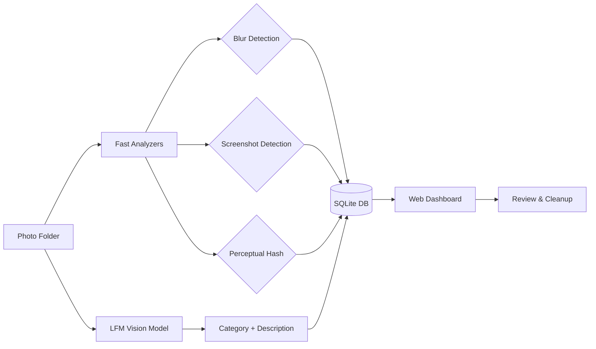
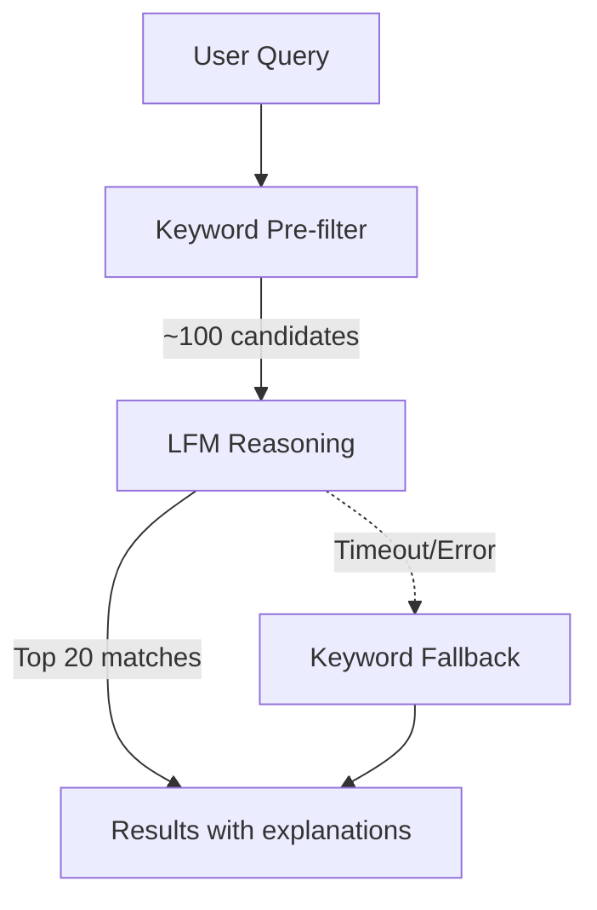

# Photo Triage Agent

Organize your photo library with AI. Locally. Privately.

## Why I Built This

I have thousands of photos scattered across my Mac—screenshots of receipts, random memes, blurry duplicates, and somewhere in there, actual memories I care about. Every few months I'd open my Photos app, feel overwhelmed, and close it again.

Cloud-based photo organizers exist, but I wasn't comfortable uploading personal photos to analyze them. I wanted something that:

- Runs entirely on my machine (no cloud APIs)
- Actually understands what's in my photos (not just filename matching)
- Helps me find duplicates and junk without manual sorting
- Lets me search naturally ("find receipts from December")

So I built this. It uses a local vision-language model to classify photos, detects duplicates with perceptual hashing, and provides a simple web UI to review and clean up.

## What It Does

- **AI Classification** — Categorize photos (people, landscapes, food, documents, screenshots) using a local LFM model
- **Duplicate Detection** — Find exact and near-duplicate photos using perceptual hashing
- **Blur Detection** — Flag blurry photos you might want to delete
- **Screenshot Detection** — Identify screenshots and memes for easy cleanup
- **Natural Language Search** — Ask "find sunset photos" or "show me receipts"
- **Safe Cleanup** — Move to trash with full undo support

All processing happens on your machine. Your photos never leave.

## Quick Start

**Requirements:** macOS 14+, Python 3.11+, 8GB RAM recommended

```bash
# Clone and install
git clone https://github.com/your-username/photo-triage-agent
cd photo-triage-agent/backend
uv sync

# Download the AI model (~1.7GB, one-time)
./scripts/download_model.sh

# Start the server
./scripts/run_backend.sh
```

Open [http://localhost:8000](http://localhost:8000) in your browser.

## How It Works



**Analysis pipeline:**
1. **Fast analyzers** run in parallel (~50ms/photo): blur detection, screenshot detection, perceptual hashing
2. **LFM vision model** classifies each photo (~2-3s/photo): generates category and natural language description
3. Results stored in SQLite for instant browsing and search

## Usage

### Web Dashboard

1. Enter the path to your photo folder (e.g., `~/Pictures`)
2. Click "Start Analysis" and watch progress
3. Browse by category, review duplicates, search with natural language
4. Trash what you don't need (with undo)

**Tip:** For iCloud Photos on macOS:
```
~/Pictures/Photos Library.photoslibrary/originals/
```

### Natural Language Search

The search understands context, not just keywords:

| Query | What it finds |
|-------|---------------|
| "sunset photos" | Landscape photos with sunset lighting |
| "receipts from stores" | Screenshots and photos of receipts |
| "blurry duplicates" | Photos that are both blurry AND have duplicates |
| "people at the beach" | Photos with people in beach/ocean settings |

### Search Flow



## Performance

Tested on Apple Silicon (M-series):

| Mode | Speed | Use Case |
|------|-------|----------|
| Full analysis | ~0.3-0.5 photos/sec | First-time analysis with AI classification |
| Quick mode | ~10-20 photos/sec | Blur, hash, screenshot detection only |
| Search | ~2-3 seconds | Natural language queries |

**Memory:** ~3-5GB during AI inference, ~100MB otherwise

## API

For scripting or building your own UI:

```bash
# Start analysis
curl -X POST http://localhost:8000/analyze/folder \
  -H "Content-Type: application/json" \
  -d '{"folder_path": "~/Pictures"}'

# Search
curl -X POST http://localhost:8000/chat \
  -H "Content-Type: application/json" \
  -d '{"message": "find all screenshots"}'
```

Full API reference in [docs/ARCHITECTURE.md](docs/ARCHITECTURE.md).

## Project Structure

```
photo-triage-agent/
├── backend/
│   ├── src/
│   │   ├── analyzers/      # Blur, screenshot, hash detection
│   │   ├── classifiers/    # LFM model integration
│   │   ├── services/       # Search, jobs, conversations
│   │   ├── api/            # FastAPI routes
│   │   └── web/            # Dashboard templates
│   ├── tests/              # 77+ tests
│   └── models/             # Downloaded AI models
├── docs/
│   ├── ARCHITECTURE.md     # Technical deep-dive
│   └── IMPLEMENTATION_PLAN.md
└── scripts/                # Setup and run scripts
```

## Privacy

- All processing happens locally on your Mac
- No cloud APIs, no telemetry, no data collection
- Photos never leave your machine
- Database stored locally in `backend/data/`

## Limitations & Roadmap

**Current limitations:**
- macOS only (Linux likely works but untested)
- Single-threaded AI inference (~2-3s per photo)
- No HEIC thumbnail support yet

**Planned improvements:**
- Faster search with dedicated text model
- Native Mac app with Photos.app integration
- Auto-organize into folders by category

## Development

```bash
# Run tests
cd backend && uv run pytest tests/ -v

# Code style
uv run ruff check src/ && uv run ruff format src/
```

## License

MIT License — do whatever you want with it.

---

Built because I was tired of my photo library being a mess.
