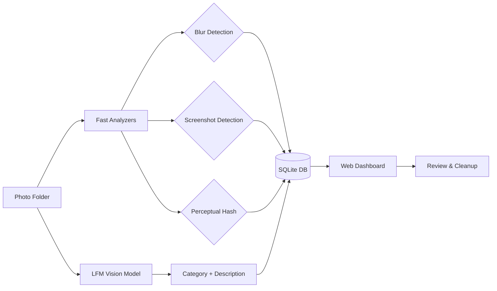
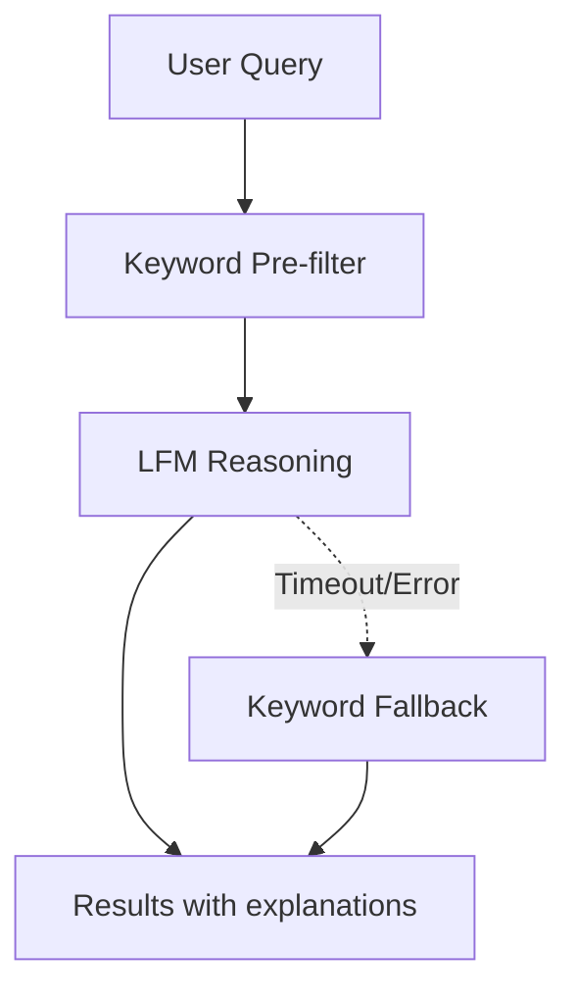

# Photo Triage Agent

Organize your photo library with AI. Locally. Privately.

## Why I Built This

I have thousands of photos scattered across my Mac—screenshots of receipts, random memes, blurry duplicates, and somewhere in there, actual memories I care about. Every few months I'd open my Photos app, feel overwhelmed, and close it again.

Cloud-based photo organizers exist, but I wasn't comfortable uploading personal photos to analyze them. I wanted something that:

- Runs entirely on my machine (no cloud APIs)
- Actually understands what's in my photos (not just filename matching)
- Helps me find duplicates and junk without manual sorting
- Lets me search naturally ("find receipts from December")

So I built this. It uses a local vision-language model to classify photos, detects duplicates with perceptual hashing, and provides a simple web UI to review and clean up.

## What It Does

**AI Classification** — Each photo is categorized into one of:

| Category | Examples |
|----------|----------|
| People | Portraits, group photos, selfies |
| Landscape | Nature, cityscapes, sunsets |
| Food | Meals, recipes, restaurant photos |
| Document | Receipts, bills, scanned papers |
| Screenshot | Phone/computer screenshots |
| Meme | Social media images, memes |
| Animal | Pets, wildlife |
| Object | Products, items, random objects |

**Quality Analysis** — Fast detection (no AI needed) for:
- **Blur detection** — Flag blurry photos you might want to delete
- **Duplicate detection** — Find exact and near-duplicate photos using perceptual hashing
- **Screenshot detection** — Identify screenshots by metadata and dimensions

**Natural Language Search** — Ask "find sunset photos" or "show me receipts from last month"

**Safe Cleanup** — Move to trash with full undo support

All processing happens on your machine. Your photos never leave.

## Quick Start

**Requirements:** macOS 14+, Python 3.11+, 8GB RAM recommended

```bash
# Clone and install
git clone https://github.com/chintan-projects/photo-triage-agent
cd photo-triage-agent/backend
uv sync

# Download the AI model (~1.7GB, one-time)
uv run ./scripts/download_model.sh

# Start the server
uv run ./scripts/run_backend.sh
```

Open [http://localhost:8000](http://localhost:8000) in your browser.

## Accessing iCloud Photos Library

To analyze your iCloud Photos library, macOS requires **Full Disk Access** permission:

1. Open **System Settings → Privacy & Security → Full Disk Access**
2. Click **+** and add **Terminal** (or iTerm/your terminal app)
3. Restart Terminal and the server

Then use this path:
```
~/Pictures/Photos Library.photoslibrary/originals/
```

**Alternative:** Export photos from Photos.app to a regular folder and analyze that instead.

## Large Libraries (10K+ photos)

For large photo libraries, use **batch processing** to analyze incrementally:

1. Set a batch size (e.g., 500 photos) in the web UI
2. Run analysis — it processes 500 new photos and stops
3. Run again — it skips already-analyzed photos and processes the next 500
4. Repeat until done

Already-analyzed photos are tracked by file hash, so you can stop and resume anytime.

```bash
# Via API: analyze 500 photos at a time
curl -X POST http://localhost:8000/analyze/folder \
  -H "Content-Type: application/json" \
  -d '{"folder_path": "~/Pictures", "limit": 500}'
```

## How It Works



**Analysis pipeline:**
1. **Fast analyzers** run first: blur detection, screenshot detection, perceptual hash
2. **LFM vision model** classifies each photo: category + natural language description
3. Results stored in SQLite for instant browsing and search

## Natural Language Search

The search understands context, not just keywords:

| Query | What it finds |
|-------|---------------|
| "sunset photos" | Landscape photos with sunset lighting |
| "receipts from stores" | Documents and screenshots of receipts |
| "blurry duplicates" | Photos that are both blurry AND have duplicates |
| "people at the beach" | Photos with people in beach/ocean settings |
| "food I cooked" | Food photos (filters out restaurant shots if described) |



## Performance

Speed depends on your Mac's hardware (M1 vs M3, RAM, etc.). After running analysis, the results page shows your actual metrics:

- **Avg inference time** per photo
- **Photos per second** throughput
- **Total processing time**

**Quick mode** (skip AI classification) is significantly faster if you only need blur detection, duplicate finding, and screenshot identification.

## API

For scripting or building your own UI:

```bash
# Start analysis (with optional batch limit)
curl -X POST http://localhost:8000/analyze/folder \
  -H "Content-Type: application/json" \
  -d '{"folder_path": "~/Pictures", "limit": 500}'

# Check progress
curl http://localhost:8000/analyze/status/{job_id}

# Search
curl -X POST http://localhost:8000/chat \
  -H "Content-Type: application/json" \
  -d '{"message": "find all screenshots"}'

# List photos by category
curl "http://localhost:8000/photos?category=document"

# Get duplicates
curl http://localhost:8000/duplicates
```

Full API reference in [docs/ARCHITECTURE.md](docs/ARCHITECTURE.md).

## Project Structure

```
photo-triage-agent/
├── backend/
│   ├── src/
│   │   ├── analyzers/      # Blur, screenshot, hash detection
│   │   ├── classifiers/    # LFM model integration
│   │   ├── services/       # Search, jobs, conversations
│   │   ├── api/            # FastAPI routes
│   │   └── web/            # Dashboard templates
│   ├── tests/              # 77+ tests
│   └── models/             # Downloaded AI models
├── docs/
│   ├── ARCHITECTURE.md     # Technical deep-dive
│   └── IMPLEMENTATION_PLAN.md
└── scripts/                # Setup and run scripts
```

## Privacy

- All processing happens locally on your Mac
- No cloud APIs, no telemetry, no data collection
- Photos never leave your machine
- Database stored locally in `backend/data/`

## Limitations & Roadmap

**Current limitations:**
- macOS only (Linux likely works but untested)
- Single-threaded AI inference (one photo at a time)
- No HEIC thumbnail support yet
- Requires Full Disk Access for Photos Library

**Planned improvements:**
- Faster search with dedicated text model
- Native Mac app with Photos.app integration
- Auto-organize into folders by category
- HEIC thumbnail generation

## Development

```bash
# Run tests
cd backend && uv run pytest tests/ -v

# Code style
uv run ruff check src/ && uv run ruff format src/
```

## License

MIT License — do whatever you want with it.

---

Built because I was tired of my photo library being a mess.
