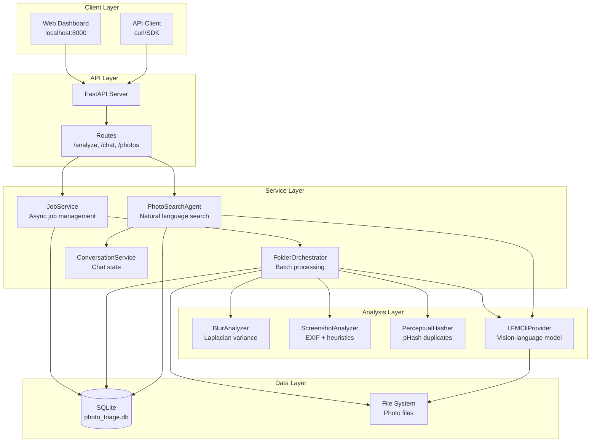
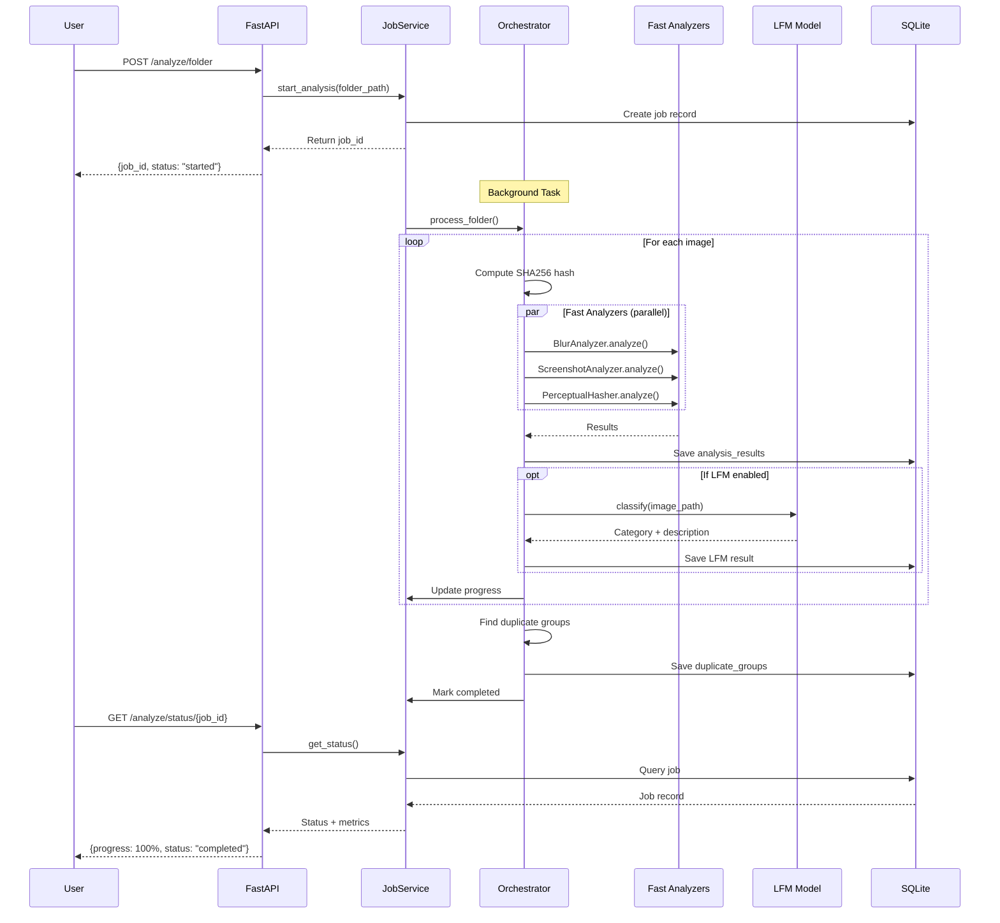
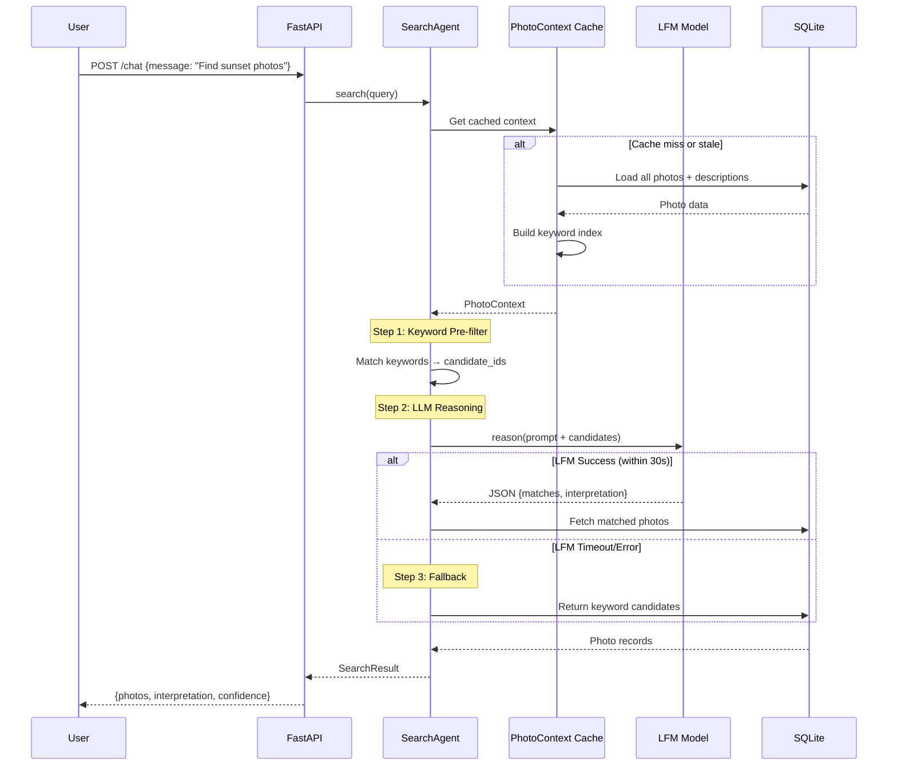
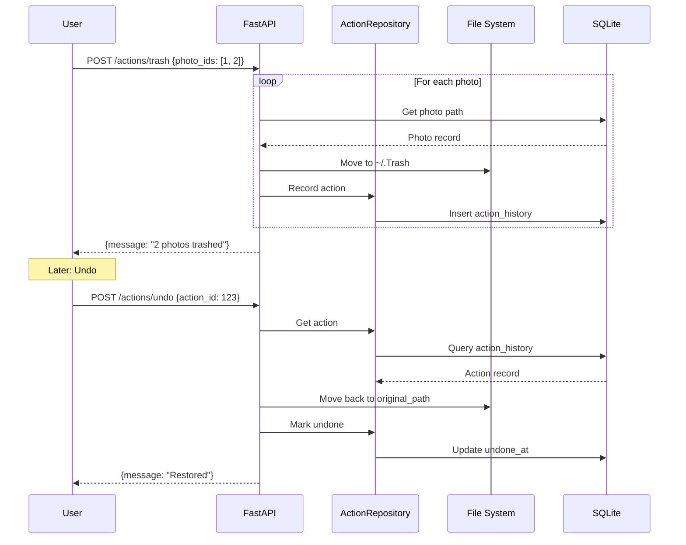
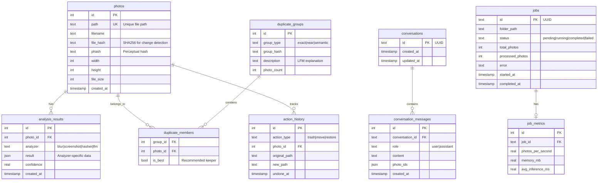

# Photo Triage Agent - Architecture Guide

> A local-first photo analysis system using LFM (Large Foundation Model) for AI classification, duplicate detection, and natural language search.

## Quick Overview

| Component | Technology | Purpose |
|-----------|------------|---------|
| Backend | FastAPI (Python 3.11+) | REST API + async job processing |
| Database | SQLite (aiosqlite) | Persistent storage, no setup needed |
| AI Model | LFM2.5-VL via llama.cpp | Image classification + reasoning |
| Frontend | Jinja2 + Vanilla JS | Server-rendered dashboard |

---

## System Architecture



---

## Core Workflows

### 1. Photo Analysis Flow

When you start analyzing a folder, here's what happens:



### 2. Natural Language Search Flow

The search uses a 3-step fallback strategy for robustness:



### 3. File Action Flow (with Undo)

All destructive operations are reversible:



---

## Project Structure

```
backend/
├── src/
│   ├── main.py              # FastAPI app + lifespan management
│   ├── config.py            # Model paths, environment config
│   ├── orchestrator.py      # Batch analysis coordinator
│   │
│   ├── api/
│   │   ├── routes.py        # All HTTP endpoints
│   │   └── schemas.py       # Pydantic request/response models
│   │
│   ├── database/
│   │   ├── schema.py        # SQLite table definitions
│   │   └── repository.py    # CRUD operations (Repository pattern)
│   │
│   ├── analyzers/           # Fast image analyzers
│   │   ├── base.py          # BaseAnalyzer interface
│   │   ├── blur.py          # Laplacian variance detection
│   │   ├── screenshot.py    # EXIF + heuristics
│   │   └── hasher.py        # Perceptual hashing
│   │
│   ├── classifiers/         # AI model providers
│   │   ├── base.py          # ModelProvider interface
│   │   ├── lfm_cli_provider.py  # llama-mtmd-cli subprocess
│   │   └── mock_provider.py     # Testing mock
│   │
│   ├── services/
│   │   ├── job_service.py   # Async job management
│   │   ├── search_agent.py  # LFM-powered search
│   │   ├── conversation.py  # Chat session state
│   │   └── upload_service.py# Photo upload handling
│   │
│   ├── utils/
│   │   └── image.py         # Image loading utilities
│   │
│   └── web/
│       ├── __init__.py      # Web router
│       ├── templates/       # Jinja2 HTML templates
│       └── static/          # CSS, JS, images
│
├── tests/                   # pytest test suite
├── models/                  # LFM model files (downloaded)
└── data/                    # SQLite database
```

---

## Database Schema



---

## Key Design Decisions

### 1. Why SQLite?

| Consideration | Decision |
|--------------|----------|
| Deployment | Zero config - just a file |
| Concurrency | aiosqlite for async access |
| Portability | Database moves with the app |
| Scale | Handles 100K+ photos easily |

**Trade-off**: No concurrent writes from multiple processes. Solved by single-writer design.

### 2. Why Subprocess for LFM?

We use `llama-mtmd-cli` via subprocess instead of Python bindings:

```python
# LFMCliProvider approach
subprocess.run([
    "llama-mtmd-cli",
    "-m", model_path,
    "-mm", mmproj_path,
    "-p", prompt,
    "--image", image_path,
])
```

**Reasons**:
- Memory isolation (model crashes don't kill server)
- Consistent with llama.cpp updates
- Works on Apple Silicon without compilation issues
- Easy to swap models

### 3. Fallback Strategy for Search

```
Query: "Photos from Japan"
         │
         ▼
┌─────────────────────┐
│ Keyword Pre-filter  │ ← Fast, <50ms
│ "japan" → 30 photos │
└─────────────────────┘
         │
         ▼
┌─────────────────────┐
│ LFM Reasoning       │ ← Accurate, 2-3s
│ Score candidates    │
└─────────────────────┘
         │ timeout?
         ▼
┌─────────────────────┐
│ Keyword Fallback    │ ← Always works
│ Return candidates   │
└─────────────────────┘
```

### 4. Analyzer Registry Pattern

New analyzers can be added without modifying orchestrator:

```python
# analyzers/__init__.py
class AnalyzerRegistry:
    _analyzers = {}

    @classmethod
    def register(cls, name, analyzer):
        cls._analyzers[name] = analyzer

    @classmethod
    def run_all(cls, image_path):
        return {name: a.analyze(image_path)
                for name, a in cls._analyzers.items()}

# Usage in orchestrator
results = AnalyzerRegistry.run_all(image_path)
```

### 5. Result Type Pattern

All analyzers return explicit success/failure:

```python
@dataclass
class Result(Generic[T]):
    success: bool
    value: T | None = None
    error: str | None = None

    @classmethod
    def ok(cls, value): return cls(True, value)

    @classmethod
    def fail(cls, error): return cls(False, error=error)

# Usage
def analyze(path: str) -> Result[AnalysisResult]:
    try:
        # analysis logic
        return Result.ok(AnalysisResult(...))
    except Exception as e:
        return Result.fail(str(e))
```

---

## API Endpoints

### Analysis

| Endpoint | Method | Description |
|----------|--------|-------------|
| `/analyze/single` | POST | Analyze uploaded image |
| `/analyze/folder` | POST | Start batch analysis job |
| `/analyze/status/{job_id}` | GET | Check job progress |
| `/analyze/results/{job_id}` | GET | Get completed results |

### Photos

| Endpoint | Method | Description |
|----------|--------|-------------|
| `/photos` | GET | List with filters (?category, ?is_blurry) |
| `/duplicates` | GET | Get duplicate groups |
| `/thumb/{photo_id}` | GET | Get thumbnail image |

### Chat/Search

| Endpoint | Method | Description |
|----------|--------|-------------|
| `/chat` | POST | Natural language search |
| `/chat/refine` | POST | Refine previous results |
| `/chat/explain` | POST | Explain photo group |

### Actions

| Endpoint | Method | Description |
|----------|--------|-------------|
| `/actions/trash` | POST | Move photos to trash |
| `/actions/undo` | POST | Undo previous action |

---

## Extending the System

### Adding a New Analyzer

1. Create analyzer class:

```python
# src/analyzers/my_analyzer.py
from .base import BaseAnalyzer, AnalysisResult, Result

class MyAnalyzer(BaseAnalyzer):
    name = "my_analyzer"
    version = "1.0.0"

    def analyze(self, image_path: str) -> Result[AnalysisResult]:
        # Your analysis logic
        return Result.ok(AnalysisResult(
            analyzer_name=self.name,
            confidence=0.9,
            metadata={"key": "value"}
        ))
```

2. Register in `__init__.py`:

```python
from .my_analyzer import MyAnalyzer
AnalyzerRegistry.register("my_analyzer", MyAnalyzer())
```

### Adding a New Model Provider

1. Implement the interface:

```python
# src/classifiers/my_provider.py
from .base import ModelProvider, ClassificationResult

class MyProvider(ModelProvider):
    name = "my_model"

    def classify(self, image_path: str) -> ClassificationResult:
        # Your model inference
        return ClassificationResult(...)

    def health_check(self) -> bool:
        return True
```

2. Configure in `config.py` and use in `main.py`.

### Adding New API Endpoints

1. Add schema in `api/schemas.py`
2. Add route in `api/routes.py`
3. Implement logic in appropriate service

---

## Performance Characteristics

| Operation | Time | Notes |
|-----------|------|-------|
| Fast analyzers (blur, screenshot, hash) | ~50ms/photo | Run in parallel |
| LFM classification | ~2-3s/photo | Apple Silicon |
| Keyword search | <50ms | Uses cached index |
| LFM search reasoning | 2-3s | With 100 candidates |
| Folder enumeration | ~1ms/1000 photos | Recursive |

**Memory Usage**:
- Base server: ~100MB
- During LFM inference: 3-5GB
- Photo context cache: ~1MB per 1000 photos

---

## Configuration

Environment variables (set in `.env` or shell):

```bash
# Model paths (defaults work if using download script)
LFM_CLI_PATH=llama-mtmd-cli

# Model settings
MODEL_N_CTX=2048           # Context size
MODEL_N_GPU_LAYERS=-1      # GPU layers (-1 = all)

# Server
API_HOST=127.0.0.1
API_PORT=8000
```

---

## Testing

```bash
# Run all tests
uv run pytest tests/ -v

# Run with coverage
uv run pytest --cov=src --cov-report=html

# Run specific test file
uv run pytest tests/analyzers/test_blur.py -v
```

Test structure mirrors source:
```
tests/
├── analyzers/
│   ├── test_blur.py
│   ├── test_screenshot.py
│   └── test_hasher.py
├── classifiers/
│   └── test_lfm_provider.py
├── database/
│   └── test_repository.py
└── test_orchestrator.py
```

---

## Forking This Project

To create your own version:

1. **Clone and setup**:
   ```bash
   git clone <your-fork>
   cd photo-triage-agent/backend
   uv sync
   ```

2. **Customize model**: Edit `config.py` to point to your model

3. **Add analyzers**: Create new classes in `analyzers/`

4. **Modify prompts**: Edit prompts in `search_agent.py`

5. **Change UI**: Edit templates in `web/templates/`

6. **Run tests**: `uv run pytest` to ensure nothing broke

Key extension points:
- `AnalyzerRegistry` - Add new image analyzers
- `ModelProvider` - Swap in different AI models
- `PhotoSearchAgent` - Customize search prompts
- `web/templates/` - Customize UI

---

## License

MIT License - See LICENSE file for details.
